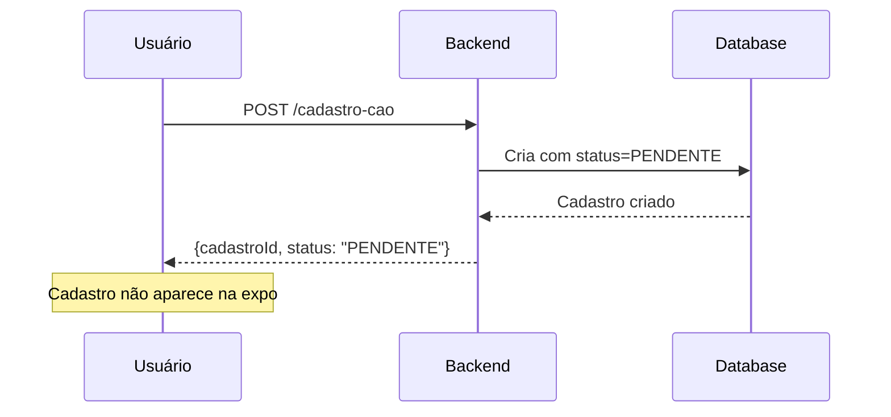
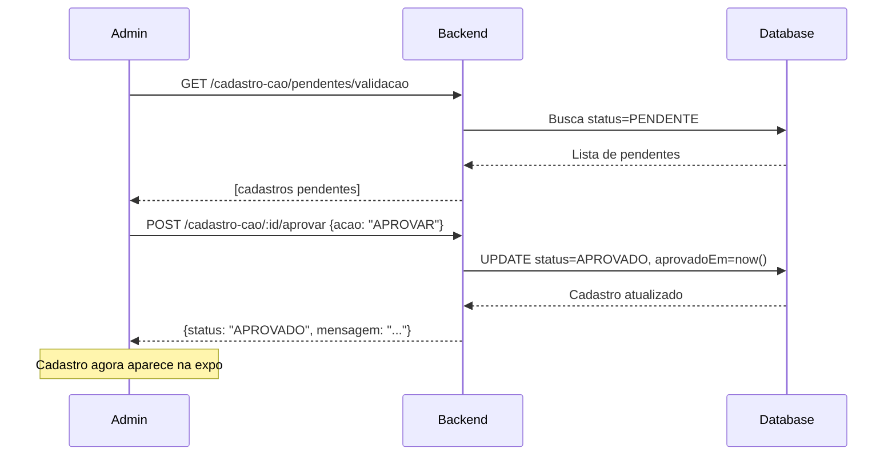
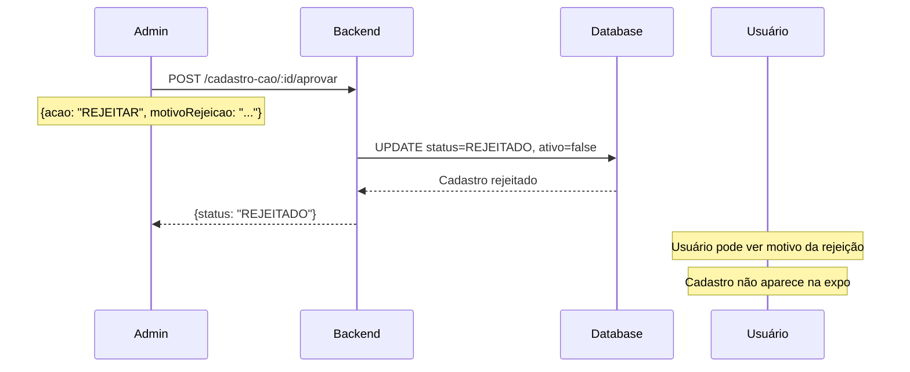

# Sistema de Aprovação de Cadastros de Cães

## Visão Geral

Este documento descreve o sistema de aprovação de cadastros de cães para a Expo Dog da Revista DogCat. O sistema garante que apenas cadastros validados apareçam na exposição e possam receber votos.

## Status de Cadastro

### Enum StatusCadastro

```prisma
enum StatusCadastro {
  PENDENTE
  APROVADO
  REJEITADO
}
```

### Fluxo de Status

```
CADASTRO CRIADO
    ↓
PENDENTE ───→ (Admin aprova) ───→ APROVADO ───→ Pode aparecer na expo
    ↓
    └────→ (Admin rejeita) ───→ REJEITADO ───→ Não aparece na expo
```

## Modelo de Dados

### Campos Adicionados ao CadastroCao

```prisma
model CadastroCao {
  // ... campos existentes ...
  
  // Campos de Aprovação
  status           StatusCadastro  @default(PENDENTE)
  motivoRejeicao   String?
  aprovadoPor      String?
  aprovadoEm       DateTime?
  
  // Campos de Votação
  totalVotos       Int             @default(0)
  ativo            Boolean         @default(true)
}
```

**Campos:**
- `status`: Status atual do cadastro (PENDENTE por padrão)
- `motivoRejeicao`: Texto explicando por que foi rejeitado (obrigatório ao rejeitar)
- `aprovadoPor`: ID do admin/funcionário que aprovou/rejeitou
- `aprovadoEm`: Data/hora da aprovação/rejeição
- `totalVotos`: Total de votos recebidos na exposição
- `ativo`: Se o cadastro está ativo (desativado ao rejeitar)

## Endpoints da API

### 1. Criar Cadastro

```
POST /cadastro-cao
```

**Comportamento:**
- Cria cadastro com `status = PENDENTE`
- Não aparece na lista pública até ser aprovado
- Usuário pode ver seus próprios cadastros pendentes

### 2. Aprovar ou Rejeitar Cadastro

```
POST /cadastro-cao/:id/aprovar
```

**Permissões:** `ADMIN`, `FUNCIONARIO`

**Body:**
```json
{
  "acao": "APROVAR", // ou "REJEITAR"
  "motivoRejeicao": "Documentação incompleta" // obrigatório se REJEITAR
}
```

**Response:**
```json
{
  "cadastroId": "clx123456789",
  "status": "APROVADO",
  "mensagem": "Cadastro aprovado com sucesso",
  "dataAcao": "2024-01-15T10:30:00.000Z"
}
```

**Regras:**
- Apenas cadastros com status `PENDENTE` podem ser aprovados/rejeitados
- Ao aprovar: `status = APROVADO`, `aprovadoEm = now()`, `aprovadoPor = adminId`
- Ao rejeitar: `status = REJEITADO`, `ativo = false`, `motivoRejeicao` obrigatório

### 3. Listar Cadastros Pendentes

```
GET /cadastro-cao/pendentes/validacao?limit=50
```

**Permissões:** `ADMIN`, `FUNCIONARIO`

**Response:**
```json
[
  {
    "cadastroId": "clx123456789",
    "nome": "Rex",
    "raca": "Golden Retriever",
    "status": "PENDENTE",
    "createdAt": "2024-01-10T08:00:00.000Z",
    "userId": "clx987654321",
    // ... outros campos
  }
]
```

**Características:**
- Ordenado por data de criação (mais antigos primeiro)
- Limite padrão: 50
- Inclui informações do proprietário

### 4. Contar Cadastros Pendentes

```
GET /cadastro-cao/pendentes/count
```

**Permissões:** `ADMIN`, `FUNCIONARIO`

**Response:**
```json
{
  "count": 5
}
```

### 5. Listar Cadastros com Filtros

```
GET /cadastro-cao?status=PENDENTE&pendentesValidacao=true
```

**Query Parameters:**
- `status`: Filtrar por status (PENDENTE, APROVADO, REJEITADO)
- `ativo`: Filtrar por ativo (true/false)
- `pendentesValidacao`: Atalho para status=PENDENTE (true/false)
- `page`: Página atual
- `limit`: Itens por página
- `search`: Buscar por nome
- `raca`: Filtrar por raça
- `sexo`: Filtrar por sexo
- `cidade`: Filtrar por cidade
- `estado`: Filtrar por estado

**Exemplo - Listar apenas aprovados:**
```
GET /cadastro-cao?status=APROVADO&ativo=true
```

## Comportamento na Exposição

### Regra de Exibição

Um cadastro **SOMENTE** aparece na exposição se:

```typescript
cadastro.status === 'APROVADO' && 
cadastro.ativo === true && 
cadastro.deletedAt === null
```

### Método na Entity

```typescript
podeParticiparVotacao(): boolean {
  return this.status === 'APROVADO' && this.ativo && !this.deletedAt;
}
```

### Filtro no Backend

Ao listar cães para votação na exposição:

```typescript
const cadastros = await prisma.cadastroCao.findMany({
  where: {
    status: 'APROVADO',
    ativo: true,
    deletedAt: null,
  },
  // ... outros filtros
});
```

## Fluxo Completo

### 1. Usuário Cadastra Cão



### 2. Admin Revisa Cadastros



### 3. Admin Rejeita Cadastro



## Interface de Administração

### Dashboard de Pendentes

**Informações exibidas:**
- Badge com contador de pendentes
- Lista ordenada por data (mais antigos primeiro)
- Dados do cão: nome, raça, sexo, idade
- Dados do proprietário: nome, email, telefone
- Links para fotos e documentos
- Botões: Aprovar / Rejeitar

### Ações do Admin

**Aprovar:**
1. Revisar fotos (perfil e lateral)
2. Verificar documentos (pedigree, microchip)
3. Validar dados cadastrais
4. Clicar em "Aprovar"
5. Cadastro liberado para exposição

**Rejeitar:**
1. Identificar problema no cadastro
2. Clicar em "Rejeitar"
3. Preencher motivo da rejeição (obrigatório)
4. Confirmar
5. Usuário é notificado do motivo

### Notificações Sugeridas

- **Email ao aprovar:** "Seu cão [Nome] foi aprovado para participar da Expo Dog!"
- **Email ao rejeitar:** "Seu cadastro de [Nome] foi rejeitado. Motivo: [motivo]"
- **Badge no admin:** Mostrar número de cadastros pendentes

## Regras de Negócio

### 1. Status Inicial
- Todo cadastro novo começa como `PENDENTE`
- Usuário não consegue mudar o status manualmente
- Apenas Admin/Funcionário pode mudar status

### 2. Transições de Status

| De         | Para       | Condição                         |
|------------|------------|----------------------------------|
| PENDENTE   | APROVADO   | Admin aprova                     |
| PENDENTE   | REJEITADO  | Admin rejeita (com motivo)       |
| APROVADO   | -          | Status final (não muda)          |
| REJEITADO  | -          | Status final (não muda)          |

> **Nota:** Se usuário corrigir cadastro rejeitado, deve criar novo cadastro

### 3. Votação

- Apenas cadastros `APROVADO` podem receber votos
- Cadastros `PENDENTE` ou `REJEITADO` não aparecem na listagem de votação
- Sistema valida antes de aceitar voto:
  ```typescript
  if (!cadastro.podeParticiparVotacao()) {
    throw new ForbiddenException('Cadastro não pode receber votos');
  }
  ```

### 4. Motivo de Rejeição

**Obrigatório ao rejeitar. Exemplos:**
- "Fotos não atendem aos requisitos de qualidade"
- "Documentação de pedigree incompleta"
- "Informações cadastrais inconsistentes"
- "Cão não atende aos critérios da exposição"

## Exemplos de Uso

### Frontend - Verificar se Cadastro Está Aprovado

```typescript
if (cadastro.status === 'APROVADO') {
  // Mostrar na lista de votação
  exibirNaExposicao(cadastro);
} else if (cadastro.status === 'PENDENTE') {
  // Mostrar badge "Em análise"
  exibirBadgePendente();
} else {
  // Mostrar motivo da rejeição
  exibirMotivoRejeicao(cadastro.motivoRejeicao);
}
```

### Frontend - Buscar Apenas Aprovados

```typescript
this.cadastroService.listar({
  status: 'APROVADO',
  ativo: 'true',
  page: '1',
  limit: '20'
}).subscribe(cadastros => {
  this.cadastrosAprovados = cadastros;
});
```

### Frontend - Admin Dashboard

```typescript
// Contador de pendentes
this.cadastroService.contarPendentes().subscribe(data => {
  this.pendentesCount = data.count;
});

// Lista de pendentes
this.cadastroService.listarPendentes().subscribe(pendentes => {
  this.cadastrosPendentes = pendentes;
});

// Aprovar
aprovar(cadastroId: string) {
  this.cadastroService.aprovar(cadastroId).subscribe(result => {
    this.notificacao.sucesso(result.mensagem);
    this.atualizarLista();
  });
}

// Rejeitar
rejeitar(cadastroId: string, motivo: string) {
  this.cadastroService.rejeitar(cadastroId, motivo).subscribe(result => {
    this.notificacao.sucesso(result.mensagem);
    this.atualizarLista();
  });
}
```

## Segurança e Permissões

### Quem Pode Aprovar/Rejeitar

- ✅ `ADMIN`
- ✅ `FUNCIONARIO`
- ❌ `USUARIO`
- ❌ `DONO_PET_APROVADO`
- ❌ `ASSINANTE`

### Validações no Backend

```typescript
@UseGuards(JwtAuthGuard, RolesGuard)
@Roles(Role.ADMIN, Role.FUNCIONARIO)
```

### Auditoria

Todos os campos são registrados para auditoria:
- `aprovadoPor`: Quem aprovou/rejeitou
- `aprovadoEm`: Quando foi aprovado/rejeitado
- `motivoRejeicao`: Por que foi rejeitado (se aplicável)

## Estatísticas e Relatórios

### Queries Úteis

**Total de cadastros por status:**
```sql
SELECT status, COUNT(*) 
FROM cadastros_cao 
WHERE deleted_at IS NULL 
GROUP BY status;
```

**Taxa de aprovação:**
```sql
SELECT 
  COUNT(CASE WHEN status = 'APROVADO' THEN 1 END) * 100.0 / COUNT(*) as taxa_aprovacao
FROM cadastros_cao 
WHERE deleted_at IS NULL;
```

**Tempo médio de aprovação:**
```sql
SELECT AVG(EXTRACT(EPOCH FROM (aprovado_em - created_at)) / 3600) as horas_media
FROM cadastros_cao 
WHERE status = 'APROVADO';
```

## Migração de Dados Existentes

Se houver cadastros antigos sem status:

```sql
-- Definir cadastros antigos como APROVADO
UPDATE cadastros_cao 
SET status = 'APROVADO', 
    aprovado_em = created_at
WHERE status IS NULL 
  AND ativo = true 
  AND deleted_at IS NULL;

-- Definir inativos como REJEITADO
UPDATE cadastros_cao 
SET status = 'REJEITADO', 
    motivo_rejeicao = 'Desativado antes da implementação do sistema de aprovação'
WHERE status IS NULL 
  AND ativo = false;
```

## Melhorias Futuras

### Curto Prazo
- [ ] Notificações por email ao aprovar/rejeitar
- [ ] Dashboard com estatísticas de aprovação
- [ ] Histórico de alterações de status

### Médio Prazo
- [ ] Sistema de comentários internos para revisão
- [ ] Múltiplos revisores (aprovação por quorum)
- [ ] Upload de documentos adicionais após rejeição

### Longo Prazo
- [ ] IA para pré-validação de fotos
- [ ] Sistema de pontuação de qualidade
- [ ] Aprovação automática para donos verificados

## Troubleshooting

### Problema: Cadastro não aparece na expo mesmo aprovado

**Verificar:**
```typescript
cadastro.status === 'APROVADO' // ✓
cadastro.ativo === true // ✓
cadastro.deletedAt === null // ✓
```

### Problema: Admin não consegue aprovar

**Verificar:**
- Role do usuário é ADMIN ou FUNCIONARIO
- Cadastro está com status PENDENTE
- Token JWT válido

### Problema: Erro ao rejeitar sem motivo

**Solução:** Campo `motivoRejeicao` é obrigatório ao rejeitar
```typescript
if (acao === 'REJEITAR' && !motivoRejeicao) {
  throw new BadRequestException('Motivo é obrigatório');
}
```

## Referências

- [Prisma Documentation](https://www.prisma.io/docs)
- [NestJS Guards](https://docs.nestjs.com/guards)
- [Role-Based Access Control](https://en.wikipedia.org/wiki/Role-based_access_control)

---

**Versão:** 1.0  
**Data:** Janeiro 2025  
**Autor:** Sistema Revista DogCat